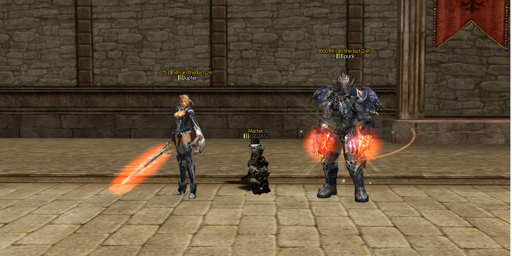

# 🏆 Character Killing Monuments BR Edition

<p align="center">
  
</p>

<p align="center">

Modern adaptation of the classic Character Killing Monuments for **Public_Brproject (L2J ExtMods / Interlude)**.

Preserving the original idea while bringing compatibility, organization and modern development practices.

</p>

---

# 📖 About

## English

Character Killing Monuments BR Edition is a modern adaptation of the classic **Character Killing Monuments** system originally developed by **Paytaly** and released on the **L2JBrasil** community in **August 2015**.

Originally designed for L2J Frozen revisions, the project became one of the most popular monument systems within the Brazilian Lineage II development community.

This adaptation preserves the original gameplay while modernizing the implementation for **Public_Brproject**, improving compatibility, organization, documentation and long-term maintenance.

---

## Português

Character Killing Monuments BR Edition é uma adaptação moderna do clássico sistema **Character Killing Monuments**, originalmente desenvolvido por **Paytaly** e publicado na comunidade **L2JBrasil** em **Agosto de 2015**.

O projeto original foi desenvolvido para revisões L2J Frozen e se tornou um dos sistemas de monumentos mais conhecidos da comunidade brasileira de desenvolvimento para Lineage II.

Esta edição preserva toda a ideia original enquanto adapta sua implementação para o **Public_Brproject**, trazendo maior compatibilidade, organização, documentação e facilidade de manutenção.

---

# ✨ Features

* 🏆 Top PvP Monument
* ☠️ Top PK Monument
* 📅 Ranking based on the last 24 hours
* 👤 Full player appearance synchronization
* 🎭 Native Polymorph / Fake Player support
* ⚡ Dynamic monument updates
* 🔄 Live update without server restart
* 🛠 Public_Brproject compatibility
* 📚 Complete documentation
* 🇧🇷 BR Edition modernization

---

# 📷 Screenshots

Screenshots are available inside:

```text
docs/images/
```

Examples:

* Top PvP Monument
* Top PK Monument
* Player Appearance
* Monument Update
* Configuration

---

# 🎥 Demonstration

A complete demonstration video is available on YouTube.

> (Video link will be added after publication.)

---

# ✅ Compatibility

| Component        | Status      |
| ---------------- | ----------- |
| Public_Brproject | ✔ Supported |
| L2J ExtMods      | ✔ Supported |
| Java 25          | ✔ Supported |
| IntelliJ IDEA    | ✔ Supported |
| L2J Interlude    | ✔ Target    |

---

# 📂 Repository Structure

```text
CharacterKillingMonuments

├── config/
├── data/
├── diff/
├── docs/
│   ├── architecture/
│   ├── guides/
│   ├── images/
│   └── releases/
│
├── html/
├── java/
├── original/
├── sql/
├── xml/
│
├── CHANGELOG.md
├── INSTALL.md
├── LICENSE
├── README.md
└── ROADMAP.md
```

---

# ⚙ Installation

1. Apply the provided diff.
2. Copy the Java source files.
3. Import the SQL scripts.
4. Configure:

```text
config/CharacterKillingMonuments.properties
```

5. Compile the project.
6. Restart the GameServer.

---

# ⚙ Configuration

Main configuration file:

```text
CharacterKillingMonuments.properties
```

Configuration examples include:

* Enable / Disable
* Update Interval
* Ranking Duration
* Monument NPC IDs
* Titles
* Messages

---

# 🧪 Administration

Administrative commands:

```text
//updatemonument
```

Forces monument refresh without restarting the server.

---

# 📚 Documentation

Additional documentation can be found inside:

```text
docs/
```

Including:

* Architecture
* Installation Guide
* Migration Notes
* Release Notes

---

# 🚧 Roadmap

Planned improvements:

* Additional ranking statistics
* Multi-language documentation
* Installation automation
* Additional configuration examples
* Future compatibility updates

---

# 👏 Credits

## Original Project

**Paytaly**

Character Killing Monuments

Published on **L2JBrasil**

August 2015

---

## Modern Adaptation

**Anton Deep**

Public_Brproject Compatibility

Code modernization

Documentation

Repository organization

Maintenance

---

## Technical Assistance

**OpenAI ChatGPT**

Support provided during:

* Architecture planning
* Debugging
* Java adaptation
* Documentation
* Code review
* Repository organization

---

## Special Thanks

* L2JBrasil Community
* Public_Brproject Developers
* L2J ExtMods
* Lineage II Development Community

---

# 📜 License

Original Character Killing Monuments belongs to its respective author.

This repository preserves all original credits.

The BR Edition includes original work regarding:

* Documentation
* Repository organization
* Compatibility improvements
* Modern adaptation
* Maintenance

Copyright © Anton Deep

---

# 🚀 Release

Current Version

```text
v1.0.0
```

Initial Public Release.

---

# 📌 Maintainer

**Anton Deep**

Maintainer of the BR Edition.

Dedicated to preserving classic Lineage II projects while adapting them for modern revisions.
