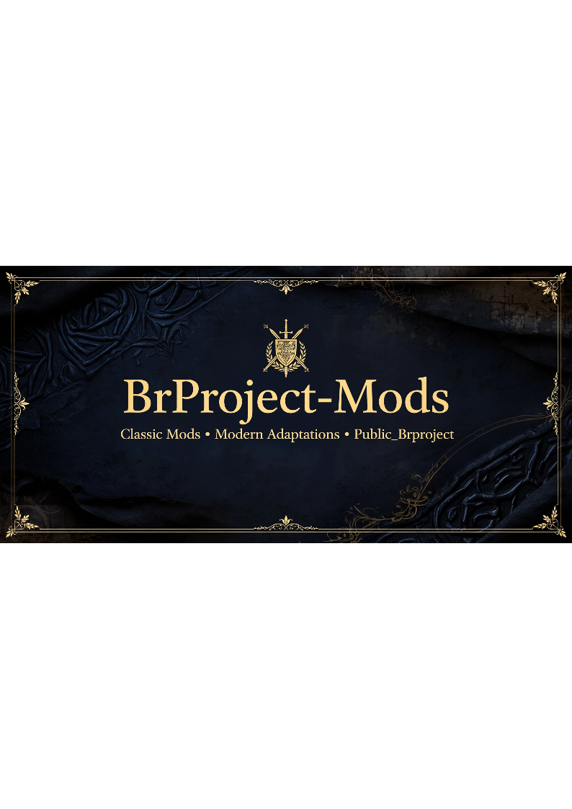

<p align="center">
  
</p>

<h1 align="center">🚀 BrProject-Mods</h1>

<p align="center">
Classic Mods • Modern Adaptations • Public_Brproject
</p>

> Preserving classic Lineage 2 community projects while adapting them for modern **Public_Brproject** revisions.
>
> Preservando projetos clássicos da comunidade Lineage 2 enquanto os adaptamos para revisões modernas do **Public_Brproject**.

---

# 📖 About

**BrProject-Mods** is a collection of custom mods, classic community projects and modern adaptations for **Public_Brproject (L2J ExtMods / Interlude)**.

The goal is to preserve the original work of the community, modernize compatibility, improve documentation and keep every original author properly credited.

Este repositório reúne mods, adaptações e sistemas para o **Public_Brproject (L2J ExtMods / Interlude)**.

O objetivo é preservar projetos clássicos da comunidade, modernizar a compatibilidade, melhorar a documentação e manter os devidos créditos aos autores originais.

---

# ✨ Available Mods

| Mod | Status | Original Author(s) | Modern Adaptation |
|------|--------|--------------------|-------------------|
| Character Killing Monuments | ✅ | Paytaly | Anton Deep |
| NPC Siege Register | ✅ | RedHoT & Smallz' | Anton Deep |

More mods will be added over time.

---

# ✅ Compatibility

| Component | Status |
|-----------|--------|
| Public_Brproject | ✔ Supported |
| Java 25 | ✔ Supported |
| IntelliJ IDEA | ✔ Supported |
| L2J ExtMods | ✔ Supported |
| Interlude | ✔ Target |

---

# 📂 Repository Structure

```text
BrProject-Mods/
│
├── CharacterKillingMonuments/
│   ├── diff/
│   ├── source/
│   ├── sql/
│   ├── html/
│   └── README.md
│
├── NPCSiegeRegister/
│   ├── diff/
│   ├── source/
│   ├── html/
│   └── README.md
│
├── docs/
├── CHANGELOG.md
├── LICENSE
└── README.md
```

---

# 🎯 Project Goals

- Preserve classic Lineage 2 projects.
- Keep original credits.
- Modernize compatibility.
- Maintain clean code.
- Provide organized documentation.
- Make installation simple.

---

# 📚 Documentation

Each mod contains its own documentation, installation guide and notes.

---

# 🤝 Contributing

Bug reports, suggestions and pull requests are welcome.

---

# 👏 Credits

## Character Killing Monuments

Original Author

- **Paytaly**

Original Release

- L2JBrasil (August 2015)

Modern Adaptation

- **Anton Deep**

---

## NPC Siege Register

Original Authors

- **RedHoT**
- **Smallz'**

Original Release

- L2JBrasil (May 2012)

Modern Adaptation

- **Anton Deep**

---

## Technical Assistance

- **OpenAI ChatGPT**

Support provided for architecture discussions, debugging, code adaptation and documentation.

---

## Special Thanks

- L2JBrasil Community
- Public_Brproject Developers
- Lineage 2 Developer Community

---

# 📜 License

See `LICENSE`.

---

# 🚀 Vision

BrProject-Mods is intended to become a well-organized collection of classic and modern mods for Public_Brproject, respecting the past while making future development easier.

---

# 📌 Maintainer

**Anton Deep**
