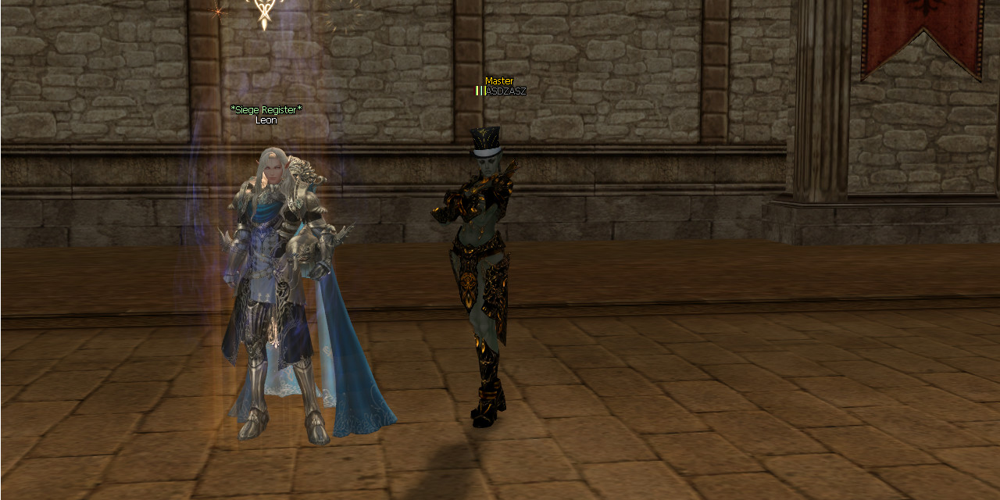

# 🏰 Siege Register NPC BR Edition

<p align="center">
  
</p>

<p align="center">

A modern adaptation of the classic Siege Register NPC for **Public_Brproject (L2J ExtMods / Interlude)**.

Making castle siege registration easier through a dedicated NPC.

</p>

---

# 📖 About

## English

Siege Register NPC BR Edition is a modern adaptation of the classic Siege Register NPC system originally released by **RedHoT**, with acknowledgements to **Smallz'**, on the **L2JBrasil** community in **May 2012**.

The original purpose of the project was simple: provide players with a single NPC capable of registering clans for castle sieges, eliminating the need to search for each castle's registration NPC.

This edition updates the original idea for modern **Public_Brproject** revisions while preserving the original concept and giving proper credit to its authors.

---

## Português

Siege Register NPC BR Edition é uma adaptação moderna do clássico sistema **Siege Register NPC**, originalmente publicado por **RedHoT**, com agradecimentos a **Smallz'**, na comunidade **L2JBrasil** em **Maio de 2012**.

O objetivo original do projeto era facilitar o registro de clãs nas Sieges através de um único NPC, evitando que os jogadores precisassem localizar o NPC de registro de cada castelo.

Esta edição adapta o sistema para revisões modernas do **Public_Brproject**, preservando sua ideia original e mantendo os devidos créditos aos autores.

---

# ✨ Features

* 🏰 Single NPC for Castle Siege Registration
* 📋 Easy Castle Selection
* ⚔️ Clan Registration Support
* 🛡️ Defender and Attacker Registration
* ⚡ Fast Navigation
* 🛠 Public_Brproject Compatibility
* 📚 Organized Documentation
* 🇧🇷 BR Edition Modernization

---

# 📷 Screenshots

Screenshots are available inside:

```text
docs/images/
```

Examples:

* Main NPC Window
* Castle Selection
* Registration Interface

---

# 🎥 Demonstration

A complete demonstration video is available on YouTube.

> https://www.youtube.com/watch?v=2RzG7pDzBzI

---

# ✅ Compatibility

| Component        | Status      |
| ---------------- | ----------- |
| Public_Brproject | ✔ Supported |
| L2J ExtMods      | ✔ Supported |
| Java 25          | ✔ Supported |
| IntelliJ IDEA    | ✔ Supported |
| L2J Interlude    | ✔ Target    |

---

# 📂 Repository Structure

```text
SiegeRegisterNpc

├── diff/
├── docs/
│   ├── images/
│   └── guides/
│
├── data/xml/npcs/custom
├── source/
│
├── CHANGELOG.md
├── INSTALL.md
├── LICENSE
├── README.md
└── ROADMAP.md
```

---

# ⚙ Installation

1. Apply the provided diff.
2. Copy the source files.
3. Compile the project.
4. Restart the GameServer.

---

# 🎮 How It Works

The NPC centralizes castle siege registration.

Players no longer need to travel to each castle's registration NPC. Instead, they can interact with a single NPC, choose the desired castle and complete the registration process through a simplified interface.

---

# 📚 Documentation

Additional documentation can be found inside:

```text
docs/
```

Including:

* Installation Guide
* Screenshots
* Future Updates

---

# 🚧 Roadmap

Future improvements:

* Multi-language HTML
* Improved interface
* Additional administration options
* Future compatibility updates

---

# 👏 Credits

## Original Project

**RedHoT**

Special Thanks

**Smallz'**

Original Release

**L2JBrasil**

May 2012

---

## Modern Adaptation

**Anton Deep**

Public_Brproject Compatibility

Repository organization

Documentation

Maintenance

---

## Technical Assistance

**OpenAI ChatGPT**

Support provided during:

* Java adaptation
* Debugging
* Repository organization
* Documentation
* Compatibility improvements

---

## Special Thanks

* L2JBrasil Community
* Public_Brproject Developers
* L2J ExtMods
* Lineage II Development Community

---

# 📜 License

Original Siege Register NPC belongs to its respective authors.

All original credits have been preserved.

The BR Edition includes original work regarding:

* Documentation
* Repository organization
* Public_Brproject compatibility
* Modern adaptation
* Long-term maintenance

Copyright © Anton Deep

---

# 🚀 Release

Current Version

```text
v1.0.0
```

Initial Public Release.

---

# 📌 Maintainer

**Anton Deep**

Maintainer of the BR Edition.

Dedicated to preserving classic Lineage II projects while adapting them for modern revisions.
